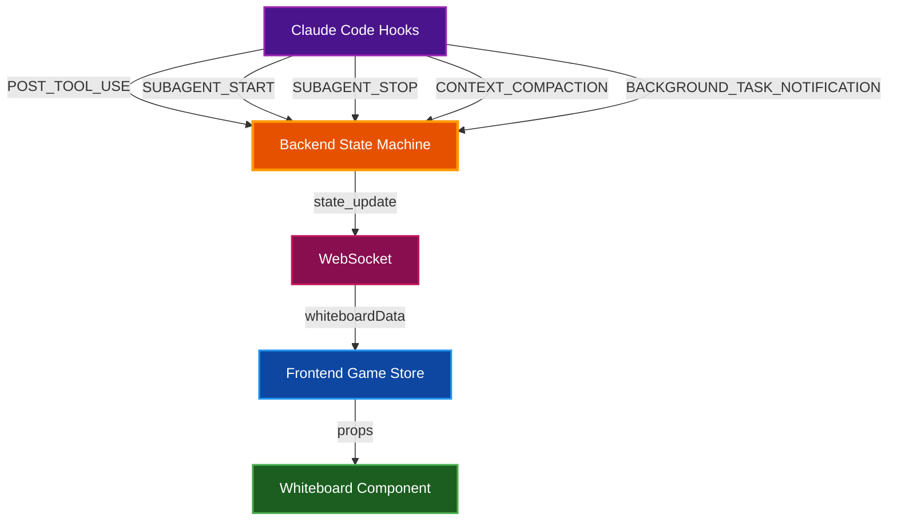

# Whiteboard Display System

The whiteboard is an interactive office element that displays session data in 11 different visualization modes. Click anywhere on the whiteboard to cycle through modes, or use keyboard shortcuts.

## Table of Contents

- [Overview](#overview)
- [Keyboard Shortcuts](#keyboard-shortcuts)
- [Display Modes](#display-modes)
  - [Mode 0: Todo List](#mode-0-todo-list)
  - [Mode 1: Remote Workers](#mode-1-remote-workers)
  - [Mode 2: Tool Use](#mode-2-tool-use)
  - [Mode 3: Org Chart](#mode-3-org-chart)
  - [Mode 4: Stonks](#mode-4-stonks)
  - [Mode 5: Weather](#mode-5-weather)
  - [Mode 6: Safety Board](#mode-6-safety-board)
  - [Mode 7: Timeline](#mode-7-timeline)
  - [Mode 8: News Ticker](#mode-8-news-ticker)
  - [Mode 9: Coffee Tracker](#mode-9-coffee-tracker)
  - [Mode 10: Heat Map](#mode-10-heat-map)
- [Data Flow](#data-flow)
- [Backend Tracking Logic](#backend-tracking-logic)
- [Related Documentation](#related-documentation)

## Overview

The whiteboard component visualizes real-time session metrics in whimsical, office-themed displays. Each mode transforms raw session data into an engaging visualization that reflects the current state of Claude Code operations.

**Interaction:** Click the whiteboard to cycle through modes (0 → 1 → 2 → ... → 10 → 0), or use keyboard shortcuts.

**Visual Elements:**
- Header bar showing current mode name and icon
- Mode indicator dots (11 dots at bottom, current mode highlighted)
- Marker tray with colored markers (decorative)

## Keyboard Shortcuts

| Key | Mode | Description |
|-----|------|-------------|
| `0` | 0 | Todo List |
| `1` | 1 | Remote Workers |
| `2` | 2 | Tool Use |
| `3` | 3 | Org Chart |
| `4` | 4 | Stonks |
| `5` | 5 | Weather |
| `6` | 6 | Safety Board |
| `7` | 7 | Timeline |
| `8` | 8 | News Ticker |
| `9` | 9 | Coffee Tracker |
| `T` | 0 | Todo List (alias) |
| `B` | 1 | Background Tasks / Remote Workers (alias) |

Mode 10 (Heat Map) is accessible by clicking from mode 9.

## Display Modes

### Mode 0: Todo List

**Icon:** `📋` **Name:** TODO

Displays the current task list from Claude's TodoWrite tool.

**Features:**
- Shows up to 5 todos at a time with auto-scroll
- Status icons: `○` pending, `▶` in progress, `✓` completed
- Color-coded by status (green=complete, blue=in-progress, gray=pending)
- Auto-centers on the currently in-progress task
- Shows page indicator when list exceeds 5 items

**Data Source:** `TodoWrite` tool calls parsed by the state machine

---

### Mode 1: Remote Workers

**Icon:** `📹` **Name:** REMOTE

Displays background task notifications in a video-call-style grid layout. Shows tasks that were run with `run_in_background: true` in Claude Code.

**Layout:**
- 3x2 grid of dark "video call" tiles
- Each tile shows: task ID, status LED, summary text
- Shows up to 6 most recent tasks
- "+N more" indicator for overflow

**Status LED Colors:**

| Status | Color | Emoji |
|--------|-------|-------|
| completed | Green | ✅ |
| failed | Red | ❌ |
| running | Blue | ⏳ |

**Data Source:** `background_task_notification` events parsed from `<task-notification>` XML in user prompts

---

### Mode 2: Tool Use

**Icon:** `🍕` **Name:** TOOL USE

Pie chart visualization of tool usage by category.

**Categories:**

| Category | Tools | Color |
|----------|-------|-------|
| read | Read, Glob, Grep | Blue |
| write | Write | Green |
| edit | Edit | Amber |
| bash | Bash | Purple |
| task | Task | Pink |
| todo | TodoWrite | Cyan |
| web | WebSearch, WebFetch | Red |
| other | All others | Gray |

**Data Source:** `POST_TOOL_USE` events tracked by `_categorize_tool()`

---

### Mode 3: Org Chart

**Icon:** `📊` **Name:** ORG

Displays boss and subagent hierarchy with humorous job titles.

**Layout:**
- Boss at top with gold-bordered box (centered)
- Up to 4 subagents displayed below in 75px wide boxes
- Agent boxes are centered as a group with connecting lines
- Each agent shows name and a silly title

**Silly Titles:**
- VP of Grepping
- Chief Byte Wrangler
- Senior Code Whisperer
- Director of Semicolons
- Head of Tab Spaces
- Minister of Merge Conflicts
- Baron of Bug Fixes
- Duke of Documentation

**Data Source:** Current agent list and boss task from game store

---

### Mode 4: Stonks

**Icon:** `📈` **Name:** STONKS

Fake stock ticker displaying session productivity metrics.

**Tickers:**

| Symbol | Tracks | Description |
|--------|--------|-------------|
| $TASK | `taskCompletedCount` | Completed todos |
| $BUG | `bugFixedCount` | Bug fixes detected |
| $CAFE | `coffeeBreakCount` | Context compactions |
| $CODE | `codeWrittenCount` | Edit/Write operations |

**Features:**
- Prices fluctuate with animated noise
- Green up arrow when count > 0, red down arrow otherwise
- Mini sparkline chart for each ticker

**Data Sources:**
- `$TASK`: Count of todos with status "completed" from `TodoWrite`
- `$BUG`: Bash commands containing "fix" in command text
- `$CAFE`: Context compaction events
- `$CODE`: Edit and Write tool uses

---

### Mode 5: Weather

**Icon:** `🌤️` **Name:** WEATHER

Weather metaphor for session health based on success rate and activity.

**Weather Conditions:**

| Condition | Icon | Trigger |
|-----------|------|---------|
| Stormy | ⛈️ | More than 5 recent errors |
| Rainy | 🌧️ | Success rate below 70% |
| Cloudy | ⛅ | Activity level below 30% |
| Sunny | ☀️ | Default (healthy session) |

**Stats Displayed:**
- Success rate percentage
- Error count
- Activity level percentage
- Total operations count

**Data Sources:**
- Success rate: `recentSuccessCount / (recentSuccessCount + recentErrorCount)`
- Activity level: `toolUsesSinceCompaction / 100` (normalized)

---

### Mode 6: Safety Board

**Icon:** `⚠️` **Name:** SAFETY

Parody of workplace safety signs showing consecutive successful tool uses.

**Display:**
- Large counter showing consecutive successes
- "SUCCESSFUL TOOL USES" label
- Time since last incident (minutes/hours/days)

**Logic:**
- Counter increments on each successful `POST_TOOL_USE`
- Counter resets to 0 on any tool failure
- Last incident time recorded on failure

**Data Source:** `consecutiveSuccesses` and `lastIncidentTime` from state machine

---

### Mode 7: Timeline

**Icon:** `📅` **Name:** TIMELINE

Gantt chart showing agent lifespans and coffee breaks during the session.

**Features:**
- Shows last 5 agents with truncated name labels
- Horizontal bars colored by agent color
- Bar length represents active duration
- Green dot indicates still-active agents
- Coffee break markers (☕) shown as dashed brown vertical lines
- Timeline freezes after session ends (uses latest agent end time instead of current time)

**Visual Elements:**
- Agent labels: 70px left margin for readability
- Agent bars: Colored by agent, with rounded caps
- Active indicator: Green dot on bars without end time
- Coffee markers: Dashed vertical lines with ☕ icon at top

**Data Sources:**
- `agentLifespans` array populated on `SUBAGENT_START` and `SUBAGENT_STOP` events
- Coffee break timestamps extracted from `newsItems` with category "coffee"

---

### Mode 8: News Ticker

**Icon:** `📰` **Name:** NEWS

Breaking news headlines about session events.

**News Categories and Colors:**

| Category | Color | Triggers |
|----------|-------|----------|
| tool | Blue | Significant tool events |
| agent | Green | Agent joins/completes, background task updates |
| session | Purple | Session start, job completion |
| error | Red | Tool failures |
| coffee | Amber | Context compaction |

**Features:**
- Cycles through news items every 4 seconds
- Shows timestamp for each headline
- "BREAKING" banner in red
- Keeps last 20 news items

**Example Headlines:**
- "🆕 Explorer-47 joins the team!"
- "✅ Code-reviewer completed their task!"
- "🎉 Job completed! Great work everyone!"
- "☕ Coffee break #3! Context compacted."
- "⚠️ Bash failed: permission denied"
- "✅ Task bg_task_a: Linting codebase..."

---

### Mode 9: Coffee Tracker

**Icon:** `☕` **Name:** COFFEE

Tracks context compaction events as coffee breaks.

**Display:**
- Large number showing total cups
- Grid of coffee cup emojis (max 15 displayed)
- "+N" indicator if more than 15 cups

**Trigger:** Each `CONTEXT_COMPACTION` event increments the counter

**Data Source:** `coffeeCups` counter in state machine

---

### Mode 10: Heat Map

**Icon:** `🔥` **Name:** HEATMAP

Bar chart showing most-edited files during the session.

**Features:**
- Shows top 5 edited files
- Bar length proportional to edit count
- Color gradient based on edit frequency:
  - Red: >80% of max
  - Orange: >60% of max
  - Amber: >40% of max
  - Yellow: >20% of max
  - Blue: ≤20% of max

**Data Source:** `fileEdits` dict populated from Edit/Write tool `file_path` parameter

## Data Flow



## Backend Tracking Logic

The state machine tracks whiteboard data in the `transition()` method:

### Tool Categorization

Tools are grouped into categories for the pizza chart:

```python
tool_categories = {
    "Read": "read",
    "Glob": "read",
    "Grep": "read",
    "Write": "write",
    "Edit": "edit",
    "Bash": "bash",
    "Task": "task",
    "TodoWrite": "todo",
    "WebSearch": "web",
    "WebFetch": "web",
}
```

### Event Processing

| Event Type | Data Updated |
|------------|--------------|
| `POST_TOOL_USE` | Tool usage, success/error counts, file edits, code written |
| `SUBAGENT_START` | Agent lifespans, news items |
| `SUBAGENT_STOP` | Agent lifespans (end time), news items |
| `CONTEXT_COMPACTION` | Coffee cups, news items |
| `SESSION_START` | News items, resets counters |
| `STOP` | News items (job completion) |
| `BACKGROUND_TASK_NOTIFICATION` | Background tasks list, news items |

### Success/Failure Tracking

```python
if success is False or error_type:
    recent_error_count += 1
    consecutive_successes = 0  # Reset safety counter
    last_incident_time = datetime.now().isoformat()
else:
    recent_success_count += 1
    consecutive_successes += 1
```

### File Edit Tracking

```python
if tool_name in ("Edit", "Write"):
    code_written_count += 1
    file_path = tool_input.get("file_path", "")
    if file_path:
        file_name = file_path.split("/")[-1]
        file_edits[file_name] = file_edits.get(file_name, 0) + 1
```

## Related Documentation

- [Architecture Overview](ARCHITECTURE.md) - System architecture and component interaction
- [State Machine](../backend/app/core/state_machine.py) - Backend event processing
- [Game Store](../frontend/src/stores/gameStore.ts) - Frontend state management
